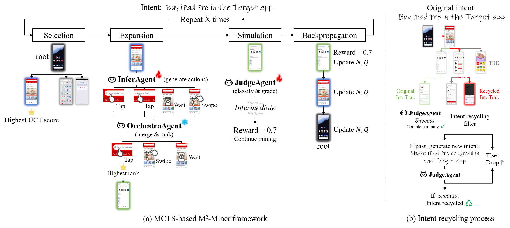
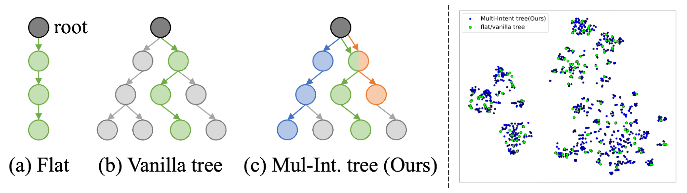

<h1 align="center">
  
  M<sup>2</sup>-Miner: Multi-Agent Enhanced Monte Carlo Tree Search for Mobile GUI Agent Data Mining
</h1>

<p align="center">
  <a href="https://doi.org/10.48550/arXiv.2602.05429">
    
  </a>
  <a href="https://larry225.github.io/M2-Miner/">
    
  </a>
</p>

<div align="left">


<div align="center">
  
  <p><em>M<sup>2</sup>-Miner: Multi-Agent Enhanced Monte Carlo Tree Search for Mobile GUI Agent Data Mining</em></p>
</div>

---

# Overview

* [News](#news)
* [Motivation](#motivation)
* [Highlights](#highlights)
* [Citation](#citation)

---

# 🎉 News
- **2026-04-18:** We released the inference code.
- **2026-02-05:** We released our paper, *M<sup>2</sup>-Miner: Multi-Agent Enhanced Monte Carlo Tree Search for Mobile GUI Agent Data Mining*.


# 🚀 Motivation

<div align="center">
  
  <p><em>Comparison of the different GUI data structure between prior methods.</em></p>
</div>

Compared to existing methods, our algorithm produces a more diverse set of intents from the same initial intent.

---

# ✨ Highlights

* 🤖 **Innovative MCTS-based GUI Agent Mining**: We introduce **M<sup>2</sup>-Miner**, the first automated MCTS-driven framework for GUI agent data mining, featuring a collaborative multi-agent system—**InferAgent, OrchestraAgent,** and **JudgeAgent**—that jointly boost mining efficiency and data quality.

* 🔄 **Intent Recycling Strategy**: We propose a novel intent recycling mechanism that extracts a wealth of valuable interaction trajectories, significantly enriching intent diversity and further enhancing mining efficiency.

* 🧠 **Progressive Model-in-the-Loop Training**: Our progressive model-in-the-loop training strategy greatly improves the mining success rate and enables strong generalization to unseen environments, supporting robust startup even in novel scenarios.

* 👑 **Superior Mining Quality and SOTA Agent Performance**: Extensive experiments confirm that our method excels in mining high-quality, diverse intent trajectories, and GUI agents trained with our data consistently achieve state-of-the-art results on standard benchmarks.

# 🤝 Acknowledgements

We thank the teams behind [Qwen2.5-VL](https://github.com/QwenLM/Qwen2.5-VL) and [AndroidControl](https://github.com/google-research/google-research/tree/master/android_control) for their foundational work, and [ms-swift](https://github.com/modelscope/ms-swift) for the efficient training and inference framework. We also thank [AgentCPM-GUI](https://github.com/OpenBMB/AgentCPM-GUI) for providing evaluation code.

# 📄 License

* Code in this repository is released under the [Apache-2.0](./LICENSE) license.

# 📄 Citation

If you use works related to **M<sup>2</sup>-Miner**, please cite our work:

```bibtex
@misc{lv2026m2miner,
      title={M<sup>2</sup>-Miner: Multi-Agent Enhanced MCTS for Mobile GUI Agent Data Mining}, 
      author={Rui Lv, Juncheng Mo, Tianyi Chu, Chen Rao, Ziqiang Dang, Hongyi Jing, Jiajie Teng, Jiafu Chen, Shiqi Zhang, Liangzi Ding, Shuo Fang, Huaizhong Lin, Chenguang Ma, Lei Zhao},
      journal={arXiv preprint arXiv:2602.05429},
      year={2026},
      doi={10.48550/arXiv.2602.05429},
      url={https://doi.org/10.48550/arXiv.2602.05429},
      note={Accepted by ICLR 2026}
}
```
If you are interested in our method or it helps your research, please give us a star 🌟 on GitHub.
